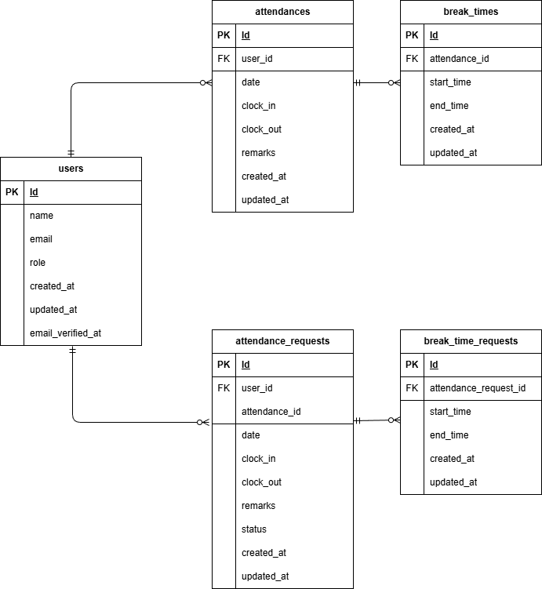

# アプリケーション名
attendance-management-app（勤怠管理アプリ）

## 環境構築手順
1. このリポジトリをクローン  
   `git clone git@github.com:sugamura-aya/attendance-management-app.git`
   
2. `docker-compose.yml` ファイル内の `php:` に以下を追記
   ```yaml
   user: "1000:1000"
   
3. PHPバージョン確認・修正
   `docker/php/Dockerfile` を開き、PHPのベースイメージが `FROM php:8.1-fpm` になっているか確認・修正。
   
4. Dockerイメージをビルド  
   `docker-compose up -d --build`
   
5. ファイル権限変更  
   `sudo chown -R $USER:$USER .`

6. PHPコンテナにログイン  
   `docker-compose exec php bash`
    
7. .env.exampleを.envにコピーして、以下の内容に変更   
   `cp .env.example .env` 
   ```env
   DB_HOST=mysql  
   DB_DATABASE=laravel_db  
   DB_USERNAME=laravel_user  
   DB_PASSWORD=laravel_pass
   ```
   
8. パッケージインストール  
   `composer install`

9. アプリキーの生成  
   `php artisan key:generate`

10. Dockerイメージを一旦コンテナを完全停止・削除、設定を反映して再構築＆起動  
   `docker-compose down`  
   `docker-compose up -d --build`  

11. マイグレーション実行  
   `php artisan migrate`

12. ダミーデータ投入（シーダー・ファクトリ使用）

    `php artisan db:seed`
    
    ※管理者・テストユーザーの生成、および一般ユーザーの90日分勤怠データを自動生成

13. シンボリックリンクの作成  （※必要に応じて実行）
    
    `php artisan storage:link`
    

## 使用技術・実行環境
このアプリケーションは Laravel と Docker を用いて構築しています。
- Laravel 8.83.8（composer.json 参照）
- PHP 8.1.32（Docker）
- MySQL 8.0.26（Docker）
- Docker 27.5.1
- Docker Compose v2.32.4

※より詳細な環境情報は composer.json および docker-compose.yml をご参照ください。

## ER図
※ ER図は下記画像を参照



## URL
一般ユーザー用（打刻・申請）
- 会員登録画面 : /register
- ログイン画面 : /login
- メール認証画面 : /email/verify （※応用機能）
- 勤怠打刻画面（トップ画面） : /attendance
- 出勤打刻処理 : /attendance/clock-in 
- 退勤打刻処理 : /attendance/clock-out 
- 休憩開始打刻処理 : /attendance/break-start 
- 休憩終了打刻処理 : /attendance/break-end
- 勤怠一覧画面 : /attendance/list
- 勤怠詳細画面 : /attendance/detail/{id}
- 勤怠申請登録処理 : /attendance/edit/{id}
- 申請一覧画面 : /stamp_correction_request/list（※ユーザー用）

管理者用（管理・承認）
- ログイン画面 : /admin/login
- ログアウト処理 : /admin/logout
- 勤怠一覧画面（全スタッフ日次） : /admin/attendance/list
- 勤怠詳細画面（直接修正） : /admin/attendance/{id}
- スタッフ一覧画面 : /admin/staff/list
- スタッフ別勤怠一覧画面 : /admin/attendance/staff/{id}
- 申請一覧画面 : /stamp_correction_request/list （※管理者用）
- 修正申請承認画面 : /stamp_correction_request/approve/{attendance_correct_request_id}

## テストユーザーのログイン情報
一般ユーザー用
- 'name' :　操作テスト用ユーザー
- 'email' : new@example.com
- 'password' : password123

管理者用
- 'name' :　管理者 太郎
- 'email' : admin@example.com
- 'password' : password123

## 実装状況メモ
- 会員登録画面
  - ログイン画面で「会員登録はこちら」→ 会員登録画面へ遷移。
  - 「登録する」ボタン → DB登録 → 勤怠打刻画面（トップ画面）へ遷移。
  - Fortifyで登録認証、パスワードのハッシュ化、バリデーション設定。
  - 【応用】メール認証機能: 登録後、認証メールが送信され「メール認証誘導画面」へ遷移。メール内のリンク押下（認証完了）で、勤怠打刻画面（トップ画面）へ遷移。
    
- ログイン画面（一般ユーザー・管理者共通）
  - 「ログインする」ボタン → 一般ユーザーは勤怠打刻画面へ、管理者は全スタッフ勤怠一覧画面へ遷移。
  - （一般ユーザー）「会員登録はこちら」ボタン → 会員登録画面へ遷移。
  - Fortifyでログイン認証、バリデーション設定。
  - 【応用】メール認証チェック: 一般ユーザーがメール認証未完了の状態でログインしようとした場合、自動的に「メール認証誘導画面」へ遷移。
   
- 勤怠打刻画面（トップ画面）
  - 現在の日付・時刻を表示。
  - 勤務ステータス（勤務外、出勤中、休憩中、退勤済）を表示。
  - ステータスに応じて「出勤」「退勤」「休憩入」「休憩戻」ボタンの活性・非活性をリアルタイムで制御。
    
- 勤怠一覧画面（一般ユーザー）
  - ログインユーザーの月次勤怠情報を一覧表示。
  - 「前月」「翌月」ボタンで表示月の切り替えが可能。
  - 「詳細」ボタン → 勤怠詳細画面へ遷移。
   
- 勤怠詳細画面（一般ユーザー）
  - 選択した日付の勤怠データ（出勤・退勤・休憩・備考）を表示。
  - 勤怠情報の修正申請機能を実装。「修正」ボタン → 修正申請が送信され、管理者の承認待ち状態となる。
  - 承認待ちの間は「承認待ちのため修正はできません。」と表示し、再編集を制限。

- 申請一覧画面（一般ユーザー）
  - 自身が行った修正申請を「承認待ち」「承認済み」のタブで切り替えて表示。
  - 「詳細」ボタン → 該当日の勤怠詳細画面へ遷移。

- 勤怠一覧画面（管理者）
  - 全ユーザーの「日次」勤怠一覧を表示。
  - 「前日」「翌日」ボタンで日付の切り替えが可能。
  - 「詳細」ボタン → 管理者用勤怠詳細（直接修正）画面へ遷移。

- スタッフ一覧画面（管理者）
  - 全一般ユーザーの氏名・メールアドレスを一覧表示。
  - 「詳細」ボタン → 各スタッフの「月次」勤怠一覧画面へ遷移。

- スタッフ別勤怠一覧画面（管理者）
  - 選択した特定のスタッフの月次勤怠情報を一覧表示。
  - 「前月」「翌月」ボタンで表示月の切り替えが可能。
  - 「詳細」ボタン → 管理者用勤怠詳細画面へ遷移。
  - 【応用】CSV出力機能: 「CSV出力」ボタン押下により、表示中の月次勤怠データをCSV形式でダウンロード可能。

- 勤怠詳細画面（管理者用・直接修正）
  - 選択した勤怠の詳細を確認できる。
  - 管理者権限による、過去の勤怠データ（出勤・退勤・休憩・備考）の直接編集・更新機能。
  - バリデーションを適用し、不適切な時間入力や備考未入力を制限。
  - 修正した内容は、即座に一般ユーザー側の勤怠情報にも反映される。

- 修正申請一覧画面（管理者）
  - 全ユーザーからの修正申請を「承認待ち」「承認済み」タブで一覧表示。
  - 「詳細」ボタン → 承認画面へ遷移。
  - 申請内容の確認を行い、「承認」ボタン押下で勤怠本番データに反映。

## 未実装（応用要件）
- メールを用いた認証機能 
- 認証メール再送機能 
- csv出力機能実装
- PHPunitを用いたテスト

## 補足（カスタム部分）
- （一般ユーザー）勤怠詳細画面　（管理者）勤怠詳細画面・修正申請承認画面：successメッセージ表示
  - 修正申請実行、承認実行成功時にリダイレクト画面上部にsuccessメッセージ表示設定。（※「修正申請中は承認実行されるまで元の勤怠データが表示」の注意事項も載せる）
- （一般ユーザー）勤怠詳細画面　（管理者）勤怠詳細画面：「修正ボタン」表示切替条件に以下を追加。
  - ログイン当日以降の日付の場合：「※本日以降の日付の勤怠は入力できません。」メッセージに切替、修正実行不可。→未来打刻回避のため。
  - ログイン当日に退勤打刻がされていない場合：「※退勤打刻が完了するまで修正はできません。」メッセージに切替、修正実行不可。→申請打刻と退勤打刻のブッキングを回避するため、打刻優先。
- （一般ユーザー）申請一覧画面　（管理者）勤怠一覧画面・スタッフ一覧画面・申請一覧画面：ページネーション実装。
- （一般ユーザー）申請一覧画面　（管理者）申請一覧画面：申請データの有無表示
  - 申請データがない場合：「現在、申請はありません。」メッセージ表示。
